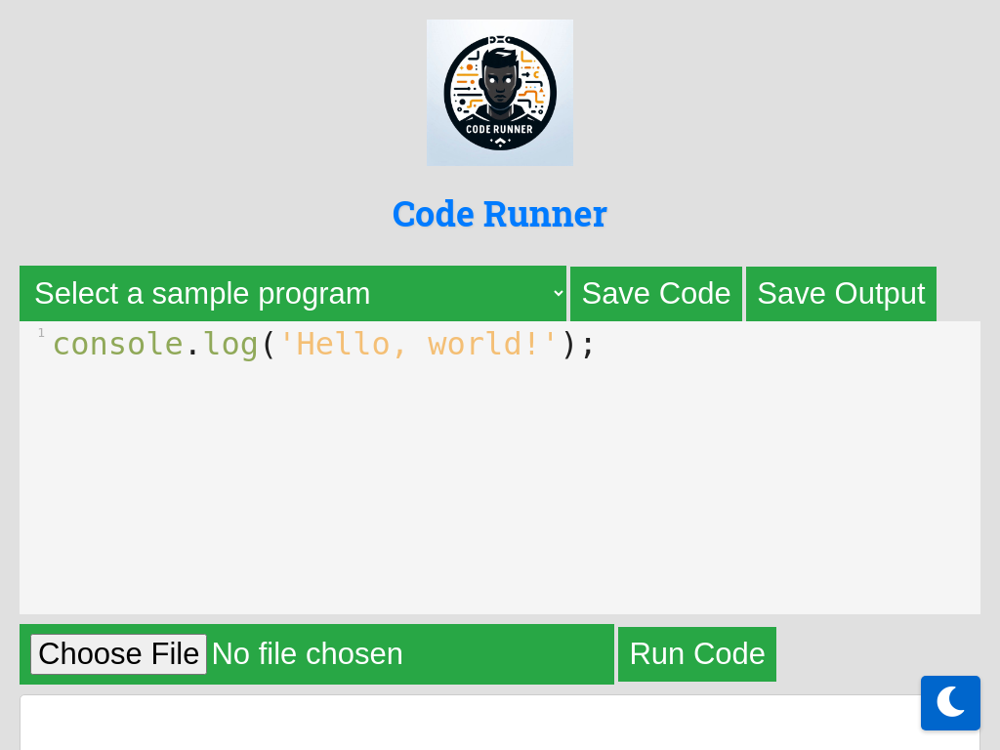

# Code Runner


## Overview

Code Runner is a simple web-based application that allows users to run JavaScript code snippets directly in the browser. It features a clean and intuitive interface for writing, running, and viewing the output of JavaScript code.

## Features

- **Code Editor**: Write your JavaScript code in the provided textarea.
- **Run Button**: Execute your code with a click of a button.
- **Output Display**: View the output of your code in a preformatted block.
- **Sample Programs**: Load sample JavaScript programs from a dropdown menu.
- **Load from File**: Load JavaScript code from your local storage.

## Screenshot



## Usage

1. **Write Your Code**: Enter your JavaScript code in the textarea.
2. **Run Your Code**: Click the "Run Code" button to execute your code.
3. **View Output**: The output of your code will be displayed in the output section.

## Installation

1. Clone the repository:
    ```bash
    git clone https://github.com/Abhrankan-Chakrabarti/code-runner.git
    ```
2. Navigate to the project directory:
    ```bash
    cd code-runner
    ```
3. Open `index.html` in your browser to start using the Code Runner.

## License

&copy; 2024 Abhrankan Chakrabarti. All Rights Reserved. Licensed under the MIT License.

## Contributing

Contributions are welcome! Please open an issue or submit a pull request.

## Contact

For any questions or suggestions, feel free to contact me at [abhrankan@gmail.com](mailto:abhrankan@gmail.com).

---

This project was created by Abhrankan Chakrabarti.